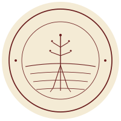
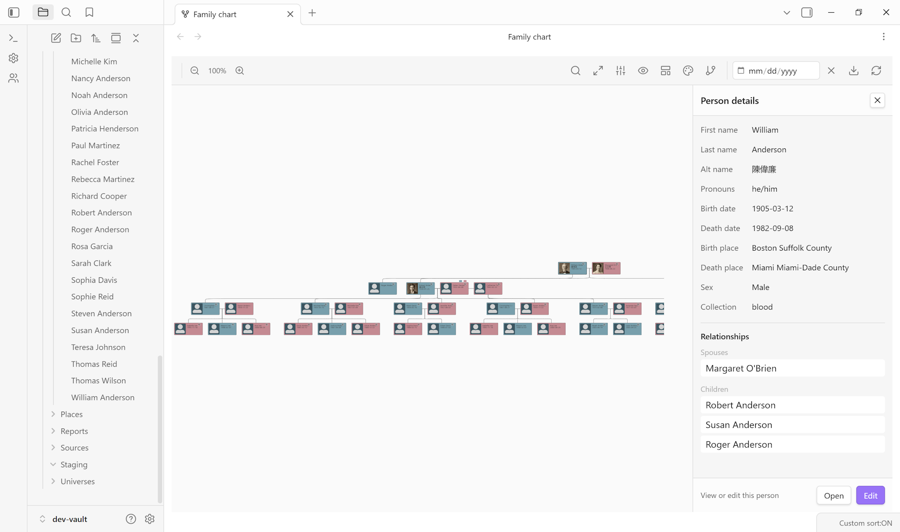
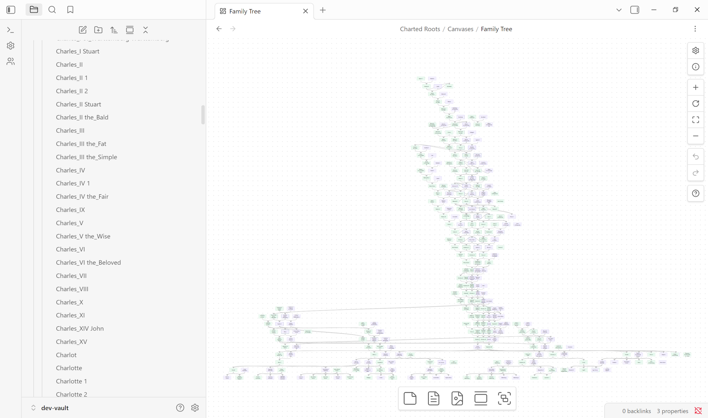
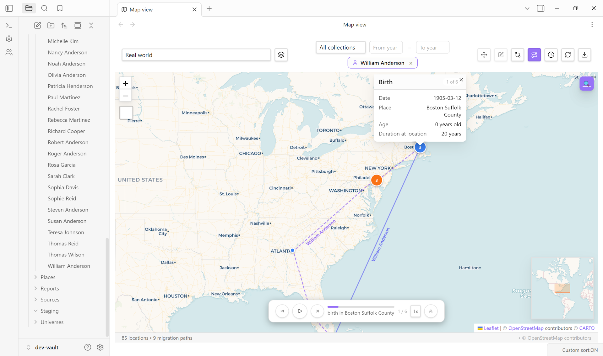
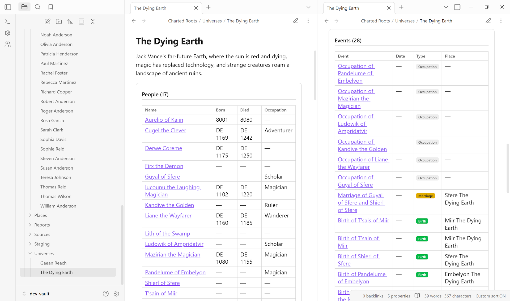
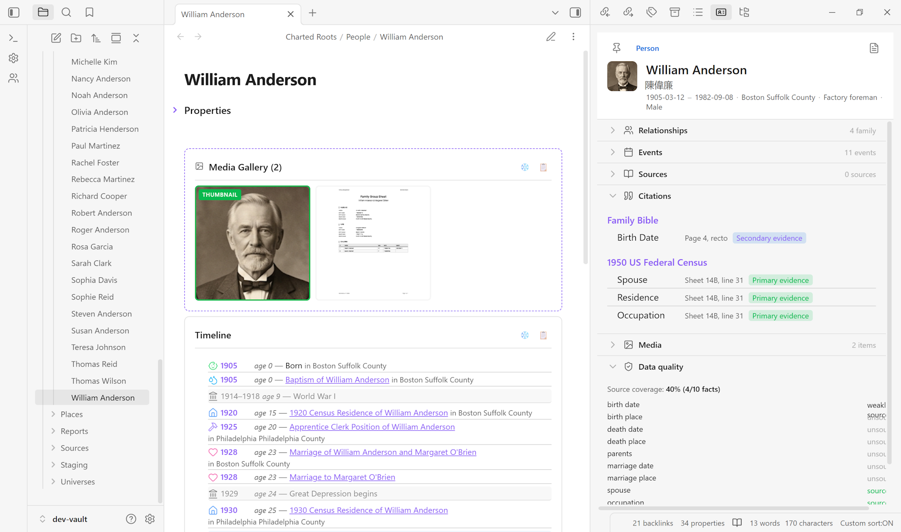
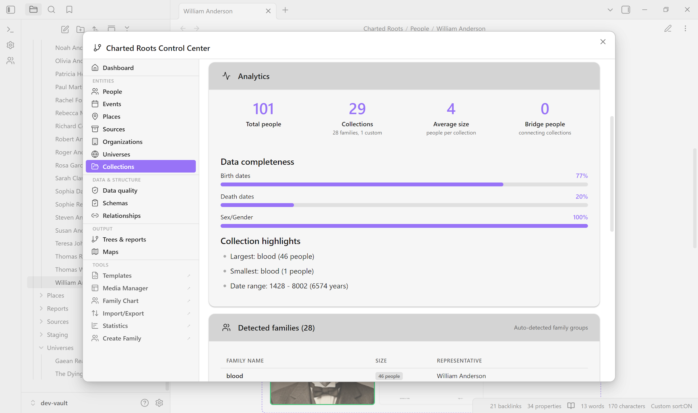

<p align="center">
  
</p>

# Charted Roots: Genealogical Family Tree Plugin for Obsidian

[](https://github.com/banisterious/obsidian-charted-roots/releases) [](docs/roadmap.md) [](https://chartedroots.com)

**Charted Roots** brings professional genealogical tools to Obsidian. Import, organize, visualize, and share family histories and fictional worlds without leaving your vault. From GEDCOM imports to PDF reports, interactive charts to map views, manage your research with the power of linked Markdown notes. Built for genealogists, historians, writers, and worldbuilders.

## Demo

| Quick tour (~2 min) | Full feature tour (~15 min) |
|:-------------------:|:---------------------------:|
| [](https://youtu.be/elQfn1fk1VQ) | [](https://www.youtube.com/watch?v=GnOHrG_nVvY) |
| Import GEDCOM → family tree → interactive chart → map view | Dynamic notes, highlight groups, custom-relationship overlay, maps, reports, worldbuilding |

---

## Screenshots

| Interactive Family Chart | Canvas Trees |
|:------------------------:|:------------:|
|  |  |

| Geographic Map View | Worldbuilding & Universes |
|:-------------------:|:-------------------------:|
|  |  |

| Evidence & Sources | Control Center |
|:------------------:|:--------------:|
|  |  |

---

## Features

### Visualize

- [**Interactive family chart**](https://github.com/banisterious/obsidian-charted-roots/wiki/Family-Chart-View) with pan/zoom, direct relationship editing, bidirectional sync, multiple color schemes, and export to PNG, SVG, PDF, or ODT
- [**Canvas trees**](https://github.com/banisterious/obsidian-charted-roots/wiki/Visual-Trees) with 4 layout algorithms (Standard, Compact, Timeline, Hourglass), multi-family detection, and PNG/SVG/PDF export
- [**Visual tree charts**](https://github.com/banisterious/obsidian-charted-roots/wiki/Statistics-And-Reports) — printable pedigree, descendant, hourglass, and fan charts as PDF, Canvas, Excalidraw, or ODT
- [**Entity profile view**](https://github.com/banisterious/obsidian-charted-roots/wiki/Entity-Profile-View) — auto-syncing sidebar with collapsible sections for all five entity types (person, place, event, source, organization)

### Import & Export

- [**GEDCOM 5.5.1**](https://github.com/banisterious/obsidian-charted-roots/wiki/Import-Export) with comprehensive field coverage and near-lossless roundtrips (name components, person attributes, family events, date ranges, burial data, cause of death, age at event)
- **GEDCOM X**, **Gramps XML** (with `.gpkg` media extraction), **CSV/TSV**, and **Excalidraw** export
- Selective branch export, privacy-aware anonymization, staging workflow for review before commit

### Research & Reports

- [**17 report types**](https://github.com/banisterious/obsidian-charted-roots/wiki/Statistics-And-Reports) — family group sheets, Ahnentafel, kinship, brick wall, gaps, timeline, and more — export as PDF, ODT, or markdown
- [**Book builder**](https://github.com/banisterious/obsidian-charted-roots/wiki/Book-Builder) — compile reports, trees, and vault notes into a single PDF or ODT with cover page, TOC, bibliography, and name index
- [**Statistics dashboard**](https://github.com/banisterious/obsidian-charted-roots/wiki/Statistics-And-Reports) with record superlatives, longevity analysis, family size patterns, migration flows, and data quality alerts
- [**Calendar view**](https://github.com/banisterious/obsidian-charted-roots/wiki/Calendar-View) — monthly grid of birthdays, death anniversaries, and marriage dates with filtering, text labels, and date navigation
- [**Evidence tracking**](https://github.com/banisterious/obsidian-charted-roots/wiki/Evidence-And-Sources) with GPS methodology — source quality classification, fact-level citations, proof summaries, conflict detection, citation generation, and [source hierarchies](https://github.com/banisterious/obsidian-charted-roots/wiki/Evidence-And-Sources#source-hierarchies) for multi-document record groups

### Geographic

- [**Interactive map view**](https://github.com/banisterious/obsidian-charted-roots/wiki/Geographic-Features) with marker clustering, migration paths, heat maps, time slider animation, [journey mode](https://github.com/banisterious/obsidian-charted-roots/wiki/Geographic-Features#journey-mode), and geocoding lookup
- [**Custom image maps**](https://github.com/banisterious/obsidian-charted-roots/wiki/Custom-Maps) for fictional worlds with pixel or geographic coordinate systems
- Place hierarchies (city -> state -> country) with six categories (real, historical, disputed, legendary, mythological, fictional)

### Data Management

- Bidirectional relationship sync with dual storage (wikilinks + `cr_id` references)
- Smart duplicate detection, merge wizard, and post-import cleanup wizard
- [Dynamic note content](https://github.com/banisterious/obsidian-charted-roots/wiki/Dynamic-Note-Content) — live-rendered timelines with historical context overlays and age annotations, relationship blocks, media galleries, research timelines, negative findings, and source lists
- [Schema validation](https://github.com/banisterious/obsidian-charted-roots/wiki/Schema-Validation), [data quality tools](https://github.com/banisterious/obsidian-charted-roots/wiki/Data-Quality), and family creation wizard

### For Worldbuilders

- [**Fictional date systems**](https://github.com/banisterious/obsidian-charted-roots/wiki/Fictional-Date-Systems) — custom calendars and eras (Middle-earth, Westeros, Star Wars, or your own)
- [**Universe notes**](https://github.com/banisterious/obsidian-charted-roots/wiki/Universe-Notes) — first-class entities for organizing fictional worlds with linked calendars, maps, and validation schemas
- [**Organization notes**](https://github.com/banisterious/obsidian-charted-roots/wiki/Organization-Notes) — noble houses, guilds, military units, corporations, religious orders
- Custom image maps, place categories for legendary/mythological/fictional locations

### Integration

- [**Obsidian Bases**](https://github.com/banisterious/obsidian-charted-roots/wiki/Bases-Integration) templates for all entity types
- [**Property aliases**](https://github.com/banisterious/obsidian-charted-roots/wiki/Settings-And-Configuration#property-aliases) and [**value aliases**](https://github.com/banisterious/obsidian-charted-roots/wiki/Settings-And-Configuration#value-aliases) — use your own frontmatter names without renaming
- [Calendarium](https://github.com/javalent/calendarium) integration, [Style Settings](https://github.com/mgmeyers/obsidian-style-settings) support, [context menu actions](https://github.com/banisterious/obsidian-charted-roots/wiki/Context-Menus)
- YAML-first data model — compatible with Dataview, Bases, and other Obsidian tools

---

## Quick Start

### 1. Enter your data

**Import existing data:** Control Center -> Import/Export tab
- Supports GEDCOM 5.5.1, GEDCOM X, Gramps XML, and CSV

**Or create notes manually:**

```yaml
---
cr_id: abc-123-def-456
name: John Robert Smith
father: "[[John Smith Sr]]"
mother: "[[Jane Doe]]"
spouse: "[[Mary Jones]]"
born: 1888-05-15
died: 1952-08-20
---
```

**Or use Obsidian Bases:** Control Center -> Guide -> "Create all bases"

### 2. Visualize your tree

**Interactive Family Chart:** Right-click a person note -> "Open family chart"
- Pan, zoom, and click to explore
- Edit relationships directly in the chart

**Or generate a canvas:** Control Center -> Canvas Trees tab
- Creates a static, shareable family tree document
- Right-click canvas -> "Regenerate canvas" to update

### 3. Explore further

- **Map view:** Visualize birth/death locations geographically
- **Statistics:** Open the Statistics Dashboard for vault health, metrics, and data quality
- **Reports:** Generate 17 report types — export as PDF, ODT, or Markdown
- **Book builder:** Compile multiple reports and trees into a single document

See the [Wiki](https://github.com/banisterious/obsidian-charted-roots/wiki) for complete documentation.

---

## Installation

### Using BRAT (Recommended)

1. Install [BRAT](https://github.com/TfTHacker/obsidian42-brat) from Community Plugins
2. Run command: `BRAT: Add a beta plugin for testing`
3. Enter: `https://github.com/banisterious/obsidian-charted-roots`
4. Enable Charted Roots in Settings → Community Plugins

### Manual Installation

1. Download from [Releases](https://github.com/banisterious/obsidian-charted-roots/releases)
2. Extract to `<vault>/.obsidian/plugins/charted-roots/`
3. Reload Obsidian and enable the plugin

### From Source

```bash
git clone https://github.com/banisterious/obsidian-charted-roots
cd obsidian-charted-roots
npm install && npm run build
```

Copy `main.js`, `styles.css`, and `manifest.json` to your vault's plugins folder.

---

## Documentation

🌐 **[Website](https://chartedroots.com)** — feature tour, guides, changelog
📖 **[Wiki](https://github.com/banisterious/obsidian-charted-roots/wiki)** — full reference docs

**Getting started:** [Installation](https://github.com/banisterious/obsidian-charted-roots/wiki/Getting-Started) · [Data entry](https://github.com/banisterious/obsidian-charted-roots/wiki/Data-Entry) · [FAQ](https://github.com/banisterious/obsidian-charted-roots/wiki/FAQ) · [Troubleshooting](https://github.com/banisterious/obsidian-charted-roots/wiki/Troubleshooting)

**Core features:** [Canvas trees](https://github.com/banisterious/obsidian-charted-roots/wiki/Visual-Trees) · [Family chart](https://github.com/banisterious/obsidian-charted-roots/wiki/Family-Chart-View) · [Import & export](https://github.com/banisterious/obsidian-charted-roots/wiki/Import-Export) · [Maps](https://github.com/banisterious/obsidian-charted-roots/wiki/Geographic-Features) · [Reports](https://github.com/banisterious/obsidian-charted-roots/wiki/Statistics-And-Reports) · [Evidence & sources](https://github.com/banisterious/obsidian-charted-roots/wiki/Evidence-And-Sources)

**Worldbuilding:** [Universe notes](https://github.com/banisterious/obsidian-charted-roots/wiki/Universe-Notes) · [Organizations](https://github.com/banisterious/obsidian-charted-roots/wiki/Organization-Notes) · [Fictional dates](https://github.com/banisterious/obsidian-charted-roots/wiki/Fictional-Date-Systems)

**Reference:** [Settings](https://github.com/banisterious/obsidian-charted-roots/wiki/Settings-And-Configuration) · [Frontmatter reference](https://github.com/banisterious/obsidian-charted-roots/wiki/Frontmatter-Reference) · [Changelog](CHANGELOG.md) · [Roadmap](https://github.com/banisterious/obsidian-charted-roots/wiki/Roadmap)

**For developers:** [Getting started](docs/developer/getting-started.md) · [Project structure](docs/developer/project-structure.md) · [Coding standards](docs/developer/coding-standards.md) · [Contributing](CONTRIBUTING.md)

---

## Contributing

Contributions welcome! See [CONTRIBUTING.md](CONTRIBUTING.md) for guidelines.

---

## Support

If you find this plugin useful, please consider supporting its development!

<a href="https://www.buymeacoffee.com/banisterious" target="_blank"></a>

---

## Issues & Support

- **Bug reports:** [GitHub Issues](https://github.com/banisterious/obsidian-charted-roots/issues)
- **Feature requests:** [GitHub Discussions](https://github.com/banisterious/obsidian-charted-roots/discussions)
- **Security:** See [SECURITY.md](SECURITY.md)

---

## License

MIT License — see [LICENSE](LICENSE)

---

## Acknowledgments

- [Obsidian Plugin API](https://docs.obsidian.md/Plugins)
- [family-chart](https://github.com/donatso/family-chart) library
- [JSON Canvas 1.0 specification](https://jsoncanvas.org/)
- Compatible with [Obsidian Bases](https://help.obsidian.md/bases) and [Advanced Canvas](https://github.com/Developer-Mike/obsidian-advanced-canvas)
