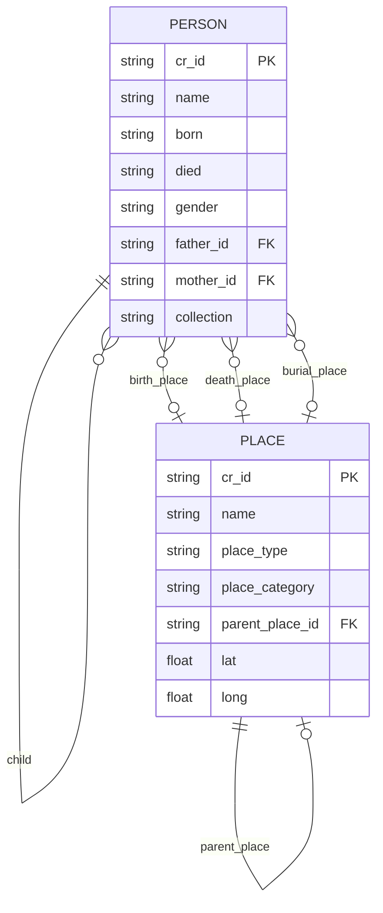

# Canvas Roots Frontmatter Schema Reference

> **Version:** 0.5.2
> **Last Updated:** 2025-12-01

This document defines all frontmatter properties recognized by Canvas Roots for person notes and place notes.

---

## Data Model Overview

The following diagram shows how the main entity types relate to each other:



**Key relationships:**
- **Person → Person**: Family relationships (father, mother, spouse, child) with dual wikilink + `_id` storage
- **Person → Place**: Geographic links for life events (birth, death, burial, marriage locations)
- **Place → Place**: Hierarchical structure (city → state → country)
- **Collection**: Shared grouping property across both entity types

---

## Person Note Properties

### Identity (Required)

| Property | Type | Description | Example |
|----------|------|-------------|---------|
| `cr_id` | `string` | Unique identifier (UUID). **Required** for all person notes. | `"a1b2c3d4-e5f6-7890-abcd-ef1234567890"` |

### Basic Information

| Property | Type | Description | Example |
|----------|------|-------------|---------|
| `name` | `string` | Display name of the person | `"John Robert Smith"` |
| `born` | `string` | Birth date (YYYY, YYYY-MM, or YYYY-MM-DD) | `"1888-05-15"` |
| `died` | `string` | Death date (YYYY, YYYY-MM, or YYYY-MM-DD) | `"1952-08-20"` |
| `birth_place` | `string` | Location of birth | `"London, England"` |
| `death_place` | `string` | Location of death | `"New York, USA"` |
| `gender` | `string` | Gender of the person | `"Male"`, `"Female"` |
| `occupation` | `string` | Primary occupation | `"Farmer"` |

### Parent Relationships

Canvas Roots supports dual storage: wikilinks for Obsidian graph visibility, plus `_id` fields for reliable programmatic resolution.

| Property | Type | Description | Example |
|----------|------|-------------|---------|
| `father` | `string` | Wikilink to father's note | `"[[John Smith Sr]]"` |
| `father_id` | `string` | Father's `cr_id` | `"f1234567-..."` |
| `mother` | `string` | Wikilink to mother's note | `"[[Mary Jones]]"` |
| `mother_id` | `string` | Mother's `cr_id` | `"m7654321-..."` |

### Spouse Relationships

#### Simple Format (Single or Multiple Spouses)

| Property | Type | Description | Example |
|----------|------|-------------|---------|
| `spouse` | `string \| string[]` | Wikilink(s) to spouse note(s) | `"[[Jane Doe]]"` or `["[[Jane Doe]]", "[[Mary Smith]]"]` |
| `spouse_id` | `string \| string[]` | Spouse's `cr_id`(s) | `"s1234567-..."` or `["s1234567-...", "s7654321-..."]` |

#### Enhanced Format (Indexed Spouse with Metadata)

For complex marital histories, use indexed properties:

| Property | Type | Description | Example |
|----------|------|-------------|---------|
| `spouse1` | `string` | Wikilink to first spouse | `"[[Jane Doe]]"` |
| `spouse1_id` | `string` | First spouse's `cr_id` | `"s1234567-..."` |
| `spouse1_marriage_date` | `string` | Date of first marriage | `"1910-06-15"` |
| `spouse1_marriage_location` | `string` | Location of first marriage | `"St. Mary's Church, London"` |
| `spouse1_marriage_status` | `string` | Status: `current`, `divorced`, `widowed`, `separated`, `annulled` | `"widowed"` |
| `spouse2` | `string` | Wikilink to second spouse | `"[[Mary Smith]]"` |
| `spouse2_id` | `string` | Second spouse's `cr_id` | `"s7654321-..."` |
| `spouse2_marriage_date` | `string` | Date of second marriage | `"1925-03-20"` |
| ... | ... | Continue pattern for spouse3, spouse4, etc. | ... |

#### Legacy Format (Structured Spouses Array)

```yaml
spouses:
  - person: "[[Jane Doe]]"
    person_id: "s1234567-..."
    marriage_date: "1910-06-15"
    marriage_location: "London"
    status: "widowed"
  - person: "[[Mary Smith]]"
    person_id: "s7654321-..."
    marriage_date: "1925-03-20"
```

### Child Relationships

| Property | Type | Description | Example |
|----------|------|-------------|---------|
| `child` | `string \| string[]` | Wikilink(s) to children's notes | `["[[John Jr]]", "[[Mary]]"]` |
| `children_id` | `string \| string[]` | Children's `cr_id`(s) | `["c1234567-...", "c7654321-..."]` |

### Canvas Roots Metadata

| Property | Type | Description | Example |
|----------|------|-------------|---------|
| `cr_root` | `boolean` | Designates this person as root of a tree | `true` |
| `collection` | `string` | User-defined grouping/collection name | `"Smith Family"` |

### Reference Numbering Systems

Canvas Roots can generate genealogical reference numbers:

| Property | Type | Description | Example |
|----------|------|-------------|---------|
| `ahnentafel` | `number` | Ahnentafel (Sosa-Stradonitz) number | `1`, `2`, `3`, ... |
| `henry` | `string` | Henry system number | `"1"`, `"11"`, `"112"` |
| `dangelo` | `string` | d'Aboville system number | `"1"`, `"1.1"`, `"1.1.2"` |
| `degroot` | `string` | de Villiers/Pama system number | `"b1"`, `"b1c2"` |
| `meurgey` | `string` | Meurgey de Tupigny system | `"I"`, `"I-1"`, `"I-1-a"` |

---

## Place Note Properties

> **Status:** Phase 1 implemented. See [geographic-features-plan.md](../architecture/geographic-features-plan.md) for future enhancements.

### Identity

| Property | Type | Description | Example |
|----------|------|-------------|---------|
| `type` | `string` | Must be `"place"` | `"place"` |
| `cr_id` | `string` | Unique identifier for the place | `"place_abc123"` |

### Basic Information

| Property | Type | Description | Example |
|----------|------|-------------|---------|
| `name` | `string` | Primary name of the place | `"London"` |
| `aliases` | `string[]` | Alternative names | `["City of London", "Londinium"]` |
| `place_type` | `string` | Type of place | `"city"`, `"village"`, `"country"`, `"castle"`, `"region"` |

### Classification

| Property | Type | Description | Example |
|----------|------|-------------|---------|
| `place_category` | `string` | Category of place | `"real"`, `"historical"`, `"disputed"`, `"legendary"`, `"mythological"`, `"fictional"` |
| `universe` | `string` | Fictional universe (for non-real places) | `"A Song of Ice and Fire"`, `"Middle-earth"` |

**Place Categories Explained:**

| Category | Description | Examples |
|----------|-------------|----------|
| `real` | Verified real-world location (default) | London, New York, Tokyo |
| `historical` | Real place that no longer exists or changed significantly | Babylon, Constantinople |
| `disputed` | Location debated by historians/archaeologists | Troy, King Solomon's Mines |
| `legendary` | May have historical basis but heavily fictionalized | Camelot, El Dorado |
| `mythological` | Place from mythology/religion | Asgard, Mount Olympus |
| `fictional` | Invented for a story/world | Winterfell, Mordor |

### Hierarchy

| Property | Type | Description | Example |
|----------|------|-------------|---------|
| `parent_place` | `string` | Wikilink to parent place | `"[[England]]"` |
| `parent_place_id` | `string` | Parent place's `cr_id` | `"place_xyz789"` |

### Coordinates

| Property | Type | Description | Example |
|----------|------|-------------|---------|
| `coordinates.lat` | `number` | Latitude (real-world) | `51.5074` |
| `coordinates.long` | `number` | Longitude (real-world) | `-0.1278` |
| `custom_coordinates.x` | `number` | X position on custom map | `450` |
| `custom_coordinates.y` | `number` | Y position on custom map | `230` |
| `custom_coordinates.map` | `string` | Path to custom map image | `"maps/westeros.png"` |

### Historical Names

```yaml
historical_names:
  - name: "Londinium"
    period: "Roman"
  - name: "Lundenwic"
    period: "Anglo-Saxon"
```

### Grouping

| Property | Type | Description | Example |
|----------|------|-------------|---------|
| `collection` | `string` | User-defined grouping (shared with person notes) | `"Smith Family"` |

The `collection` property allows places to be grouped with related person notes. For example, a "Smith Family" collection could include both the Smith family members and the places associated with them.

---

## Property Naming Conventions

Canvas Roots follows these conventions:

| Convention | Examples |
|------------|----------|
| **Snake_case** for all properties | `birth_place`, `father_id`, `cr_id` |
| **Singular** for single values | `father`, `mother`, `spouse` |
| **Plural** for arrays (legacy) | `spouses` (structured array) |
| **`_id` suffix** for cr_id references | `father_id`, `spouse_id`, `children_id` |
| **Indexed properties** for ordered multiples | `spouse1`, `spouse2`, `spouse1_marriage_date` |

---

## Essential Properties

When using "Add essential properties" in Data Quality tools, these properties are added if missing:

- `cr_id` (generated UUID)
- `name` (empty string)
- `born` (empty string)
- `died` (empty string)
- `father` (empty string)
- `mother` (empty string)
- `spouses` (empty array)

---

## Example Person Note

```yaml
---
cr_id: "a1b2c3d4-e5f6-7890-abcd-ef1234567890"
name: "John Robert Smith"
born: "1888-05-15"
died: "1952-08-20"
birth_place: "London, England"
death_place: "New York, USA"
gender: "Male"
occupation: "Merchant"
father: "[[John Smith Sr]]"
father_id: "f1234567-..."
mother: "[[Mary Jones]]"
mother_id: "m7654321-..."
spouse1: "[[Jane Doe]]"
spouse1_id: "s1111111-..."
spouse1_marriage_date: "1910-06-15"
spouse1_marriage_location: "St. Mary's Church, London"
spouse1_marriage_status: "widowed"
spouse2: "[[Margaret Brown]]"
spouse2_id: "s2222222-..."
spouse2_marriage_date: "1935-09-01"
child:
  - "[[John Smith Jr]]"
  - "[[Mary Elizabeth Smith]]"
children_id:
  - "c1111111-..."
  - "c2222222-..."
cr_root: true
collection: "Smith Family"
ahnentafel: 1
---

# John Robert Smith

Notes about this person...
```

---

## Example Place Note

```yaml
---
type: place
cr_id: "place_london_001"
name: "London"
aliases:
  - "City of London"
  - "Londinium"
place_category: real
place_type: city
parent_place: "[[England]]"
coordinates:
  lat: 51.5074
  long: -0.1278
historical_names:
  - name: "Londinium"
    period: "Roman (43-410 AD)"
  - name: "Lundenwic"
    period: "Anglo-Saxon (600-886 AD)"
---

# London

Capital city of England and the United Kingdom...
```

---

## See Also

- [Geographic Features Plan](../architecture/geographic-features-plan.md) - Place notes design
- [Coding Standards](../developer/coding-standards.md) - Property naming conventions
