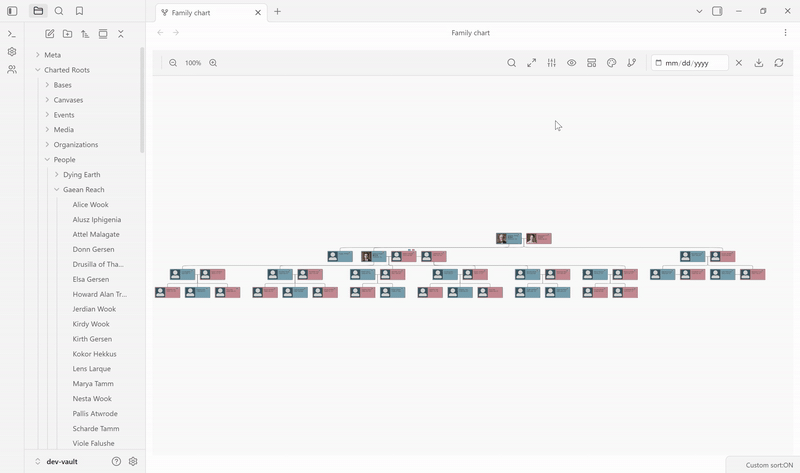

# Custom Relationships

Custom relationships allow you to define and track non-family connections between people in your genealogical database. While standard family links (father, mother, spouse, children) are handled automatically, custom relationships let you capture additional connections like godparents, guardians, mentors, witnesses, and more.

---

## Table of Contents

- [Overview](#overview)
- [Built-in Relationship Types](#built-in-relationship-types)
- [When to Use Non-Family Relationships](#when-to-use-non-family-relationships)
- [Adding Custom Relationships](#adding-custom-relationships)
- [Frontmatter Format](#frontmatter-format)
- [Display in the Profile View](#display-in-the-profile-view)
- [Control Center - Relationships Tab](#control-center---relationships-tab)
- [Canvas Edge Rendering](#canvas-edge-rendering)
- [Commands and Context Menu](#commands-and-context-menu)
- [Best Practices](#best-practices)

---

## Overview

Custom relationships are:
- **Stored in person note frontmatter** in a `relationships` array
- **Typed** - each relationship has a defined type with properties like color and inverse
- **Directional or symmetric** - some relationships have inverses (godparent/godchild), others are symmetric (witness)
- **Separate from family links** - they complement but don't replace standard genealogical connections

### Terminology

To avoid confusion, Charted Roots uses distinct terms:

| Term | Description |
|------|-------------|
| **Family links** | Standard genealogical connections (father, mother, spouse, children) shown in the People tab |
| **Custom relationships** | Extended relationship types managed in the Relationships tab |

---

## Built-in Relationship Types

Charted Roots ships with **25 built-in non-family relationship types across 6 categories**, covering common genealogical needs and extending to worldbuilding, historical fiction, and social-network research scenarios.

Core family links (spouse, parent, child, sibling) are handled by dedicated frontmatter fields — see [Essential Properties](Essential-Properties) — and don't need to be added as custom relationships.

### Legal / Guardianship

| Type | Inverse | Color | Line |
|------|---------|-------|------|
| Guardian | Ward | Teal | Solid |
| Step-parent | Step-child | Teal | Dashed |
| Adoptive parent | Adopted child | Cyan | Dotted |
| Foster parent | Foster child | Sky | Solid |

### Religious / Spiritual

| Type | Inverse | Color | Line |
|------|---------|-------|------|
| Godparent | Godchild | Blue | Solid |
| Mentor | Disciple | Purple | Solid |

### Professional

| Type | Inverse | Color | Line |
|------|---------|-------|------|
| Master | Apprentice | Orange | Solid |
| Employer | Employee | Orange | Solid |

### Social

| Type | Inverse | Color | Line |
|------|---------|-------|------|
| Witness | *(one-way)* | Gray | Dashed |
| Neighbor | *(symmetric)* | Gray | Dashed |
| Companion | *(symmetric)* | Green | Solid |
| Betrothed | *(symmetric)* | Pink | Dashed |

### Feudal / World-building

For political and social hierarchies in historical fiction or worldbuilding universes:

| Type | Inverse | Color | Line |
|------|---------|-------|------|
| Liege lord | Vassal | Gold | Solid |
| Ally | *(symmetric)* | Emerald | Dashed |
| Rival | *(symmetric)* | Red | Dashed |

### DNA / Genetic

Opt-in — requires the `enableDnaTracking` setting:

| Type | Inverse | Color | Line |
|------|---------|-------|------|
| DNA match | *(symmetric)* | Purple | Dashed |

DNA match is a statistical/biological relationship, not a genealogical one — it's kept separate so the genealogical data model stays clean.

---

## When to Use Non-Family Relationships

These types are easy to overlook if you only use Charted Roots for traditional genealogy. A few use cases worth considering:

**Genealogical research (FAN networks)**
- Mark witnesses on wills, baptisms, and marriages — these often reveal friend/family networks that weren't otherwise documented
- Track neighbors across census records to surface FAN (Friends, Associates, Neighbors) clusters for focused research
- Document mentor/apprentice relationships from trade apprenticeship records

**Historical fiction and worldbuilding**
- Track liege/vassal hierarchies in a fictional nobility or a real historical court
- Model shifting alliances and rivalries across generations of a dynasty
- Follow master/apprentice chains through a magical or craft tradition
- Represent betrothals that didn't result in marriages (useful for dynastic-politics stories)

**Collaborative and household tracking**
- Guardian/ward and foster/adoptive relationships for orphan networks and non-biological parenting
- Companions and household members for documenting who lived or traveled together, especially for historical or ecclesiastical research

---

## Adding Custom Relationships

### Via Context Menu

1. Right-click on a person note
2. Navigate to **Charted Roots** → **Relationships** → **Add custom relationship...**
3. In the modal:
   - Select the relationship type from the dropdown (grouped by category)
   - Click "Select person" to choose the target person
   - Optionally add notes about the relationship
4. Click "Add relationship"

**Symmetric types auto-propagate.** When the chosen type is flagged symmetric (e.g., `twin`, `neighbor`, `ally`), the Add Relationship modal also writes the reciprocal entry onto the target person's note, so you only need to add the link once. Idempotent: if the target already lists you via the same type, the modal silently skips — safe to re-run from either side. Asymmetric types (`mentor` → `disciple`, `captor` → `prisoner`) are not auto-propagated; set the inverse side explicitly on the other person if you want both ends represented.

**Symmetric types also clean up on deletion.** Because a symmetric link is written to both notes, removing it from one person's frontmatter also removes the matching reciprocal entry from the linked person's note, so the relationship disappears from both sides. Asymmetric types aren't stored on the other person (their inverse is shown on the fly), so there's nothing to clean up there.

### Via Command Palette

1. Open a person note
2. Open the command palette (`Ctrl/Cmd + P`)
3. Run **Charted Roots: Add custom relationship to current person**
4. Follow the same modal workflow as above

### Manual Frontmatter

Charted Roots writes custom relationships as **flat frontmatter properties**, one set per relationship type. For each type, the plugin writes a primary key (e.g. `godparent`) holding the wikilink(s), plus a paired `_id` key holding the `cr_id`(s) for robust tracking. Optional metadata (notes, dates) lives on parallel `_notes` / `_from` / `_to` arrays index-aligned with the primary array.

This keeps frontmatter flat — no nested objects — for compatibility with Obsidian's frontmatter editor, Bases, Dataview, and other tooling.

```yaml
---
name: John Smith
cr_id: person-john-smith
godparent: "[[Jane Doe]]"
godparent_id: person-jane-doe
godparent_notes: "Became godparent at baptism in 1920"
mentor: "[[Robert Brown]]"
mentor_id: person-robert-brown
---
```

For multiple targets of the same type, the values become arrays:

```yaml
godparent: ["[[Jane Doe]]", "[[Sarah Lee]]"]
godparent_id: [person-jane-doe, person-sarah-lee]
godparent_notes: ["Became godparent at baptism in 1920", "Confirmed in 1925"]
```

The `_notes` (and `_from` / `_to`) arrays are padded with empty strings for entries without metadata, so the indices stay aligned with the targets array.

---

## Frontmatter Format

### Relationship Properties

For a relationship type with id `<type>`, Charted Roots reads/writes:

| Property | Required | Type | Description |
|----------|----------|------|-------------|
| `<type>` | Yes | `string` or `string[]` | Wikilink(s) to the target person note(s) |
| `<type>_id` | Yes | `string` or `string[]` | `cr_id`(s) of the target(s) — paired with the primary array index |
| `<type>_notes` | No | `string` or `string[]` | Optional per-target notes — paired with the primary array index |
| `<type>_from` | No | `string` or `string[]` | Optional start date(s) of the relationship — paired with the primary array index |
| `<type>_to` | No | `string` or `string[]` | Optional end date(s) of the relationship — paired with the primary array index |

Always include `<type>_id` for robust linking. Even if notes are renamed, the `cr_id` reference ensures the relationship remains valid.

### Example

```yaml
godparent: ["[[Jane Doe]]", "[[Sarah Lee]]"]
godparent_id: [person-jane-doe, person-sarah-lee]
godparent_notes: ["Became godparent at baptism in 1920", ""]
godparent_from: ["1920", ""]

mentor: "[[Robert Brown]]"
mentor_id: person-robert-brown

witness: "[[Mary Johnson]]"
witness_id: person-mary-johnson
witness_notes: "Witnessed marriage ceremony"
```

In this example, Jane Doe is a godparent with both a note and a start date; Sarah Lee is a godparent without metadata (note empty, date empty); Robert is a mentor without any metadata (no `_notes` / `_from` / `_to` keys at all when there's nothing to record); Mary is a witness with a note.

### Legacy nested-array format

Earlier versions of the wiki documented a nested `relationships:` array shape. That format is still **read** by the plugin for backward compatibility, but Charted Roots no longer writes it — new entries from the Add Custom Relationship modal use the flat format above. If you have existing data in the legacy shape, it will continue to work unchanged; you don't need to migrate.

```yaml
# Legacy shape — still readable, no longer written
relationships:
  - type: godparent
    target: "[[Jane Doe]]"
    target_id: person-jane-doe
    notes: "Became godparent at baptism in 1920"
```

---

## Display in the Profile View

The [Entity Profile View](Entity-Profile-View) splits a person's relationships into two subsections — **Family** and **Other**. Where a custom-typed relationship lands depends on its **category**:

- **Non-family categories** (`legal`, `religious`, `professional`, `social`, `feudal`, `dna`, or any custom category you've defined) render in the **Other** subsection, grouped by category. Each row shows the type name as a label, then the target person's link, then any per-relationship `<type>_notes` in italic muted text indented to align with the link column.
- **Family-category custom types** (e.g. a user-defined `twin`, or anything else you've filed under `family`) render **inline in the Family subsection** alongside Father / Mother / Spouse / Child rows, grouped by type name. Each row shows the type name as a label, the target person's link, and any per-relationship notes beneath. The relationship still has to declare a target; only the rendering surface differs.

Built-in family fields (`father`, `mother`, `spouse`, `children`, etc.) are not custom relationships — they're stored in dedicated frontmatter properties and rendered from the family graph, not from the `<type>` parallel arrays. Custom types with a `familyGraphMapping` (like a custom `sire` mapping to `parent`) are an intermediate case: they appear in the Other subsection with their custom name (e.g. "Sire") instead of the generic "Parent" label, and the Family subsection suppresses the duplicate generic entry on that crId.

---

## Control Center - Relationships Tab

The Relationships tab in Control Center provides comprehensive relationship management:

### Custom Relationship Types Card

- **Table view** of all available relationship types
- **Color swatches** showing edge colors for each type
- **Category column** showing type grouping
- **Inverse column** showing the inverse relationship (if any)
- **Source column** indicating built-in or custom types
- **Toggle** to show/hide built-in types
- **Create** button — opens the Relationship Type editor for defining a new custom type with your own name, color, line style, category, and family-chart-overlay flag
- **Add category** button — define a new category to group your custom types under
- **Edit / delete** actions on each type's row — customize built-in types or modify your own

#### The "Maps to" field — caveat

The Relationship Type editor includes a **Maps to** dropdown that lets a custom type declare itself as a family-graph variant of a built-in type (e.g., a custom "Sire" type mapping to `parent`, or a custom "Adoptee" mapping to `adopted_child`). This setting does double duty:

1. **Display:** controls how the type renders on the Family Chart (e.g., a `parent` mapping draws a parent-edge line rather than an overlay arc).
2. **Write routing:** the "Add Relationship" modal *writes* relationships of this type into the mapped built-in field. A type mapped to `parent` writes to the source person's `father` / `mother` (or gender-neutral `parents` array). A type mapped to `spouse` writes to the next `spouse<N>` slot. A type mapped to `child` appends to the children array.

**Conflict handling (v0.22.47+):** for scalar mapped fields (`father`, `mother`), the Add Relationship modal checks whether the field is already set on the source person before overwriting. If it points to a different person, a confirmation modal surfaces showing which person is being replaced; choosing **Replace `<name>`** proceeds with the overwrite (and cleans up the previous parent's `children` array so they don't keep claiming a child who's been re-parented), choosing **Cancel** (default on Escape / click-out) preserves the existing data. The spouse path uses an array form already, so a `Maps to: Spouse` write appends rather than overwrites. Closed in [#606](https://github.com/banisterious/obsidian-charted-roots/issues/606). **On v0.22.46 and earlier**, scalar parent writes were silently overwritten with only a passing notice — recovery required Obsidian's file-recovery snapshot.

If you want a custom relationship type to appear as an overlay line *without* affecting built-in family fields, leave **Maps to** blank — overlay rendering still works via the **Render on family chart as overlay line** toggle (which is independent of Maps to).

### Custom Relationships Card

- **List of all custom relationships** defined in the vault
- **Clickable source and target names** to open person notes
- **Relationship type** with color indicator
- **Statistics summary** at top

### Statistics Card

- Total relationships count
- Breakdown by relationship type
- People with custom relationships count

---

## Canvas Edge Rendering

Custom relationships can be rendered as colored edges on canvas trees:

- Each relationship type defines an **edge color** — renders in both vanilla Obsidian Canvas and [Advanced Canvas](https://github.com/Developer-Mike/obsidian-advanced-canvas)
- Relationship types can also specify **dashed or dotted line styles** — but these only render when the **Advanced Canvas** plugin is installed. Vanilla Obsidian Canvas ignores edge style attributes and renders all edges as solid lines. Colors display correctly regardless.
- Enable/disable custom relationship edges in tree generation settings

> **Tip:** Install the Advanced Canvas community plugin if you want distinguishing line styles (dashed, dotted) on canvas trees. Without it, different relationship types remain distinguishable by color and label.

---

## Family Chart Overlay



*Toggling the overlay reveals styled arcs (Mentor, Best friend, Business partner) drawn on top of the biological tree.*

Custom relationships can also render as **styled overlay lines on the interactive Family Chart**, independently of whether they participate in tree structure. This is decoupled from the tree-structure integration described in [Data Model](Data-Model) — a relationship type can be tree-only, overlay-only, or both.

### Enabling overlay rendering per type

In the Relationship Type editor modal (Control Center → Relationships → edit a type), the **Family chart overlay** section has a toggle:

- **Render on family chart as overlay line** — when enabled, this type draws as a styled line between the two people it connects on the Family Chart view, using the type's color and line style.

### Display toggles on the Family Chart

Once one or more types have the overlay flag enabled, open the Family Chart view's **Display** menu:

- **Show custom relationships** — master toggle that enables/disables the entire overlay layer
- **Per-type toggles** — when multiple overlay-enabled types exist, each appears as its own toggle indented under the master toggle, letting you focus on specific categories

### How overlay lines render

Overlay rendering picks between two visual treatments based on the relationship type:

- **Purely non-family types** (`ally`, `mentor`, `sire`, `liege`, `godparent`, etc.) render as **curves that arc below the chord between the two cards.** The sag scales with chord length, so short and long spans both read as clearly-curved. Curvature signals "this is not a family line," independent of where the endpoints sit in the tree.
- **Adopted / step / foster types** (which map onto a structural parent-child link) **restyle the existing parent-child line** with the overlay's color and dash pattern when that link is visible and uncomplicated — no separate line is drawn. When the pair has a duplicate card (f3 chart renders some people twice when they appear in multiple family contexts) or the structural link isn't in the current view, rendering falls back to the arc.

Common properties regardless of treatment:

- Color matches the relationship type's configured color
- Line style matches the type's configured style (solid / dashed / dotted)
- **Multiple relationships on the same pair (arc rendering)** stack with a perpendicular offset so they don't overlap — useful when two people have, e.g., both `ally` and `mentor` between them
- **Symmetric types** (`ally`, `friend`, etc.) render one line per pair, not two
- **Asymmetric types** (`mentor` → `disciple`, `captor` → `prisoner`) render one line in the declared direction
- **As-of date filter** (from the Family Chart toolbar): relationships with `from`/`to` date ranges are skipped when the selected date is outside the range

### Hover tooltip

Hovering a line (either an arc or a restyled structural link) shows a tooltip with: source name, relationship type, target name, and date range if present. A widened transparent hit target sits over each line so hover-for-tooltip works without pixel-precise cursor placement.

### Use cases

- **Worldbuilding** — Political allegiances, liege/vassal relationships, rivalries, magical bonds, vampire sire/childer lineages rendered alongside biological kinship
- **Genealogy** — FAN-network relationships (friends, associates, neighbors), godparent/godchild, master/apprentice, witness relationships
- **Research** — Any non-family connection that helps contextualize a person's social or professional network

---

## Commands and Context Menu

### Commands

| Command | Description |
|---------|-------------|
| Add custom relationship to current person | Opens the Add Relationship modal for the active person note |
| Open relationships tab | Opens Control Center to the Relationships tab |

### Context Menu

Right-click on a person note:
- **Charted Roots** → **Relationships** → **Add custom relationship...** - Opens the Add Relationship modal

---

## Best Practices

### Use the paired `_id` property

Always include the `<type>_id` property alongside the `<type>` wikilink. Even if notes are renamed, the `cr_id` reference ensures the relationship remains valid. The Add Custom Relationship modal does this automatically; for hand-written frontmatter, write both keys together.

### Be Consistent

Use the same relationship type across your database. For example, always use `godparent` rather than mixing "Godparent" and "godparent".

### Add Notes

Document when and where the relationship was established. This context is valuable for future research.

### Consider Inverses

Some relationships should be added to both people:
- **Symmetric types** (`neighbor`, `ally`, `companion`, etc.) auto-propagate — adding the relationship from one side writes the reciprocal entry on the target's note automatically
- **Asymmetric types** with an inverse (`godparent` → `godchild`, `mentor` → `disciple`) currently need to be added manually on the inverse side if you want both ends represented

### Separate from Family Links

Don't use custom relationships for connections that are already handled by family links:
- Use `father`/`mother` for parents, not "Biological Parent" custom relationship
- Use `spouse` for marriages, not custom relationship types

---

## Coming Soon

- **Automatic asymmetric inverse creation** — adding John as Jane's godparent would also write Jane as John's godchild. (Symmetric types like `neighbor` and `ally` already auto-propagate.)
- **Bulk relationship management** — multi-select and batch operations on the Custom Relationships card
