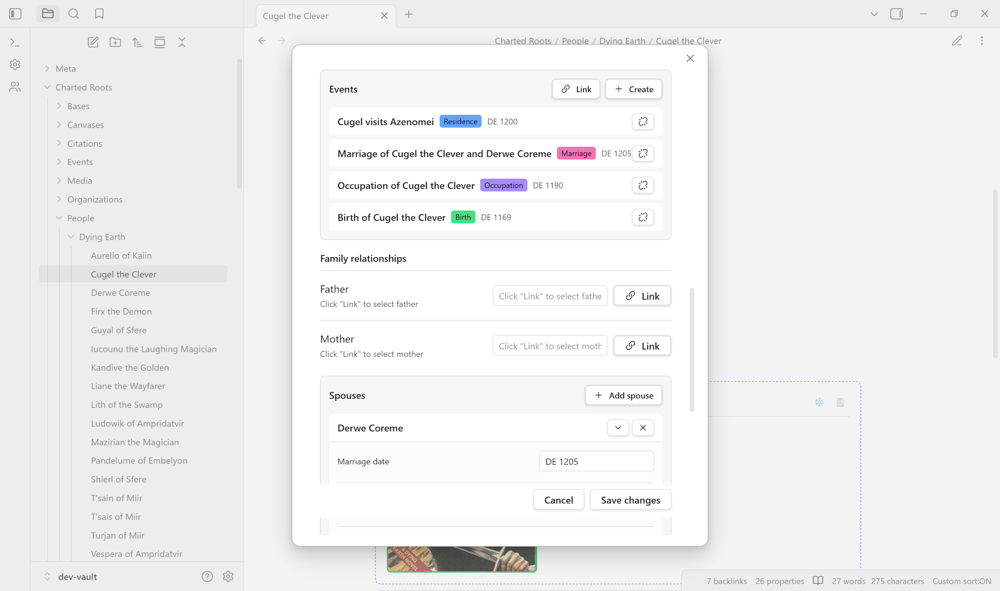

# Data Entry

This page covers how to create person notes with relationship data that Charted Roots uses to generate family trees.

> **Reference:** For a complete list of all supported properties, see the [Frontmatter Reference](Frontmatter-Reference).

---

## Table of Contents

- [Create Person Modal](#create-person-modal)
- [Name Fields](#name-fields)
- [Family Creation Wizard](#family-creation-wizard)
- [Edit Modal Enhancements](#edit-modal-enhancements)
- [Quick Start: Adding Properties via Context Menu](#quick-start-adding-properties-via-context-menu)
- [Individual Markdown Notes](#individual-markdown-notes)
- [Example Person Note](#example-person-note)
- [Multiple Spouse Support](#multiple-spouse-support)
- [Wikilinks vs IDs](#wikilinks-vs-ids)
- [Clipping from Web Sources](#clipping-from-web-sources)
- [Bulk Data Entry](#bulk-data-entry)
- [Other Data Types](#other-data-types)
- [Next Steps](#next-steps)

---

## Create Person Modal

The Create Person Modal provides a form-based interface for creating new person notes with all essential properties pre-populated.

### Opening the Modal

| Method | Description |
|--------|-------------|
| Command palette | `Charted Roots: Create person` |
| Dashboard | Click "Create Person" tile |
| Control Center | People tab → Actions → Create person |
| Folder context menu | Right-click a people folder → Create person |

### Features

- **Auto-generated cr_id** — Unique identifier created automatically
- **Folder selection** — Choose destination folder (pre-populated from folder context menu)
- **Basic fields** — Name, nickname, sex, birth date
- **State persistence** — If accidentally closed, your progress is saved and can be restored

### "Add Another" Flow

After creating a person, you have two options:

| Button | Action |
|--------|--------|
| **Create & Open** | Creates the person and opens the new note |
| **Create & Add Another** | Creates the person and resets the form to create another in the same folder |

The "Add Another" flow is useful when entering multiple family members in sequence.

---

## Name Fields

The `name` property is the person's **display name** — it is what appears on Family Chart cards and in the links between notes, and it defaults to the note's title. It is treated as free text, so there is no required "First Last" format. Write it however you want it to read — `Aegon V Targaryen`, `Hans von Duisburg`, or `Dr. John Smith Jr.` are all fine as the `name` value.

### Optional Name Parts

For genealogical precision and accurate GEDCOM export, Charted Roots can also store the individual pieces of a name in their own optional properties. These do not change what is displayed — they add structure that export and search can use:

| Property | Purpose | Example |
|----------|---------|---------|
| `name_prefix` | Title or honorific (GEDCOM NPFX) | `Dr.`, `Rev.`, `Dame` |
| `name_suffix` | Generational suffix (GEDCOM NSFX) | `Jr.`, `III`, `V` |
| `surname_prefix` | Surname particle (GEDCOM SPFX) | `von`, `de la` |
| `given_name` | First/given name(s) | `María José` |
| `surnames` | Family name(s), one or more | `García, López` |
| `maiden_name` | Birth surname | `Johnson` |
| `nickname` | Informal name or alias | `Bobby` |
| `alt_name` | Alternate name for multilingual display | `张三` |

A typical record fills the display name plus whichever parts you care about:

```yaml
name: Dr. John Smith Jr.
name_prefix: Dr.
name_suffix: Jr.
```

None of the parts are required — `name` on its own is enough for a complete person note.

### Notes

- **GEDCOM import** fills these fields automatically. The generational suffix is also folded into the display name (so `John Smith` plus `III` becomes `John Smith III`), which keeps same-named relatives distinct. When entering people by hand, there is no need to repeat the suffix in both `name` and `name_suffix` unless you want it shown.
- The Create and Edit Person form currently offers Name, Nickname, Given name, Surname(s), and — in edit mode — Maiden and Married names. The prefix and suffix fields are set in the note's properties directly, or arrive through import.

---

## Family Creation Wizard

The Family Creation Wizard is a 5-step guided workflow for creating interconnected family groups with automatic bidirectional relationship linking.

### Opening the Wizard

| Method | Description |
|--------|-------------|
| Command palette | `Charted Roots: Create family wizard` |
| Dashboard | Click "Create Family" tile |
| Control Center | People tab → Actions → Create family |
| Folder context menu | Right-click a people folder → Create family |

### Workflow Steps

| Step | Name | Description |
|------|------|-------------|
| Start | Choose Mode | Select "Start from Scratch" or "Build Around Person" |
| 1 | Central Person | Create the central person (skipped in "Build Around" mode) |
| 2 | Add Spouses | Add spouse(s) — create new or pick existing |
| 3 | Add Children | Add children — create new or pick existing |
| 4 | Add Parents | Add father and/or mother — create new or pick existing |
| 5 | Review | Preview family tree and confirm creation |

### Modes

**Start from Scratch**
- Create yourself first as the central person
- Add family members around you step by step
- All people are created fresh

**Build Around Person**
- Select an existing person from your vault
- Add family members around them
- Mix of existing and new people

### Features

- **Bidirectional linking** — All relationships are linked in both directions automatically
- **Existing person picker** — Select existing people instead of creating duplicates
- **Tree preview** — Visual preview shows the family structure before creation
- **State persistence** — Progress is saved if the wizard is accidentally closed
- **Relationship merging** — When building around an existing person, new relationships merge with existing ones

---

## Edit Modal Enhancements



*Cugel the Clever (Dying Earth fixture) with four life events, parents, and spouse with marriage date populated.*

The Edit Modal (opened by right-clicking a person note → Edit) includes features for managing relationships.

### Inline Person Creation

Create new people directly from relationship fields without leaving the Edit Modal:

1. Open the Edit Modal for a person
2. Find a relationship field (Spouse, Father, Mother, Children)
3. Click the **+** button next to the field
4. Fill in the mini-form (name, sex, birth date)
5. Click "Create" — the new person is created and linked automatically

### Children Management

The Edit Modal includes a dedicated Children section:

- **View existing children** — Displayed as clickable links
- **Add child via picker** — Click "Add existing" to select from your vault
- **Create new child** — Click "+" to create and link a new child inline

Children are stored using two array properties:
- `child` — Display names (wikilinks)
- `children_id` — cr_id references for robust linking

### Living Status

A **Living status** dropdown sits directly under the death and burial fields, in both the Create Person and Edit Person modals. It controls the `cr_living` property without hand-editing frontmatter:

| Option | Effect |
|--------|--------|
| **Automatic** | Living status is inferred from the death date and the living-age threshold (the default; clears any manual override) |
| **Living** | The person is treated as living and protected in privacy-aware exports (sets `cr_living: true`) |
| **Deceased** | The person is treated as deceased and not protected (sets `cr_living: false`) |

The control is always available — it no longer requires privacy protection to be enabled. The `cr_living` value it sets is the same one the timeline's context lifespan window reads to extend a living person's range. See [`cr_living`](Frontmatter-Reference#person-properties) and [Privacy & Security](Privacy-And-Security) for details.

### Nickname Display

The Edit Modal header displays the person's nickname (if set) alongside their formal name, making it easy to identify people with informal names.

### Alternate Name (`alt_name`)

For multilingual genealogy, the `alt_name` property displays an alternate name (e.g., native script alongside romanized form) across all views:

```yaml
alt_name: 张三
```

When set, the alternate name appears:
- Below the main name on **Family Chart View** cards
- In the **Person details** panel of the Family Chart
- Below the person name in **map view** marker popups
- In the **Entity Profile View** header
- On **visual tree chart** nodes (SVG and Excalidraw export)

---

## Quick Start: Adding Properties via Context Menu

The fastest way to set up a person note is using the context menu:

1. Create a new markdown note for the person
2. Right-click the file in the file explorer
3. Select **Charted Roots → Add essential person properties**

This automatically adds all required fields (`cr_id`, `cr_type`, `name`) plus common optional fields (`born`, `died`, `father`, `mother`, `spouse`). You can also select multiple files and add properties to all of them at once.

> **Tip:** See [Context Menus](Context-Menus) for all available right-click actions.

## Individual Markdown Notes

Create individual notes for each person with YAML frontmatter containing relationship data.

### Required Fields

- `cr_id`: Unique identifier (UUID format recommended)
- `cr_type`: Must be `"person"` for person notes
- `name`: Person's name

### Optional Relationship Fields

- `father`: Wikilink to father's note
- `father_id`: Father's `cr_id` value
- `mother`: Wikilink to mother's note
- `mother_id`: Mother's `cr_id` value
- `spouse`: Wikilink(s) to spouse(s)
- `spouse_id`: Spouse `cr_id` value(s)
- `children`: Array of wikilinks to children
- `children_id`: Array of children's `cr_id` values

### Optional Date Fields

- `born`: Birth date (YYYY-MM-DD format recommended)
- `died`: Death date (YYYY-MM-DD format recommended)

## Example Person Note

```yaml
---
cr_id: abc-123-def-456
cr_type: person
name: John Robert Smith
father: "[[John Smith Sr]]"
father_id: xyz-789-uvw-012
mother: "[[Jane Doe]]"
mother_id: pqr-345-stu-678
spouse: ["[[Mary Jones]]"]
spouse_id: ["mno-901-jkl-234"]
children: ["[[Bob Smith]]", "[[Alice Smith]]"]
children_id: ["def-456-ghi-789", "abc-123-xyz-456"]
born: 1888-05-15
died: 1952-08-20
---

# Research Notes

[Your biographical research, sources, and notes here...]
```

## Multiple Spouse Support

For complex marital histories, use indexed spouse properties:

```yaml
---
cr_id: abc-123-def-456
cr_type: person
name: John Robert Smith

# First spouse
spouse1: "[[Jane Doe]]"
spouse1_id: "jane-cr-id-123"
spouse1_marriage_date: "1985-06-15"
spouse1_divorce_date: "1992-03-20"
spouse1_marriage_status: divorced
spouse1_marriage_location: "Boston, MA"

# Second spouse
spouse2: "[[Mary Johnson]]"
spouse2_id: "mary-cr-id-456"
spouse2_marriage_date: "1995-08-10"
spouse2_marriage_status: current
spouse2_marriage_location: "Seattle, WA"
---
```

### Indexed Spouse Properties

For each spouse (spouse1, spouse2, etc.), you can specify:

| Property | Description | Example |
|----------|-------------|---------|
| `spouseN` | Wikilink to spouse's note | `"[[Jane Doe]]"` |
| `spouseN_id` | Spouse's cr_id | `"jane-cr-id-123"` |
| `spouseN_marriage_date` | Wedding date | `"1985-06-15"` |
| `spouseN_divorce_date` | Divorce date (if applicable) | `"1992-03-20"` |
| `spouseN_marriage_status` | Status: current, divorced, widowed, annulled | `divorced` |
| `spouseN_marriage_location` | Wedding location | `"Boston, MA"` |

## Wikilinks vs IDs

Charted Roots supports both wikilinks and ID-based relationships:

**Wikilinks** (`father`, `mother`, `spouse`, `children`):
- Human-readable in your notes
- Work with Obsidian's graph view and backlinks
- Require exact note name matches

**IDs** (`father_id`, `mother_id`, `spouse_id`, `children_id`):
- More robust - survive note renames
- Required for GEDCOM import/export
- Enable bidirectional sync features

**Best Practice:** Use both for maximum compatibility:

```yaml
father: "[[John Smith Sr]]"
father_id: xyz-789-uvw-012
```

## Clipping from Web Sources

Capture genealogical data directly from web pages using [Obsidian Web Clipper](https://help.obsidian.md/Clipper). This method is ideal for collecting data from online sources like obituaries, Find A Grave, FamilySearch, and historical archives.

### Quick Overview

1. Install Obsidian Web Clipper browser extension
2. Configure output to your Charted Roots staging folder
3. Create Web Clipper templates with special metadata properties
4. Clip content from web pages
5. Review and verify in Staging Manager (Dashboard shows "3 clips (1 new)")
6. Promote verified data to your main tree

### When to Use Web Clipper vs Other Methods

| Method | Best For |
|--------|----------|
| **Web Clipper** | Capturing data from websites (obituaries, Find A Grave, FamilySearch) |
| **Manual Entry** | Adding known family members with existing knowledge |
| **GEDCOM Import** | Migrating from other genealogy software |
| **CSV Import** | Structured data from spreadsheets |

### Benefits of the Staging Workflow

The Web Clipper integration uses Charted Roots' staging folder, which provides:
- Review clips before adding to main tree
- Detect potential duplicates before promotion
- Verify LLM-extracted data for accuracy
- Batch process multiple clips at once

### Learn More

See the full [Web Clipper Integration](Web-Clipper-Integration) guide for:
- Detailed setup instructions
- Template creation tips
- LLM extraction best practices
- Troubleshooting common issues

---

## Bulk Data Entry

For entering many family members at once, consider using [Obsidian Bases](Bases-Integration) which provides a spreadsheet-like interface for editing frontmatter across multiple notes.

## Other Data Types

Charted Roots also supports Places and Organizations, each with their own data entry workflows:

### Place Notes

Geographic locations for births, deaths, and other events. Place notes support:
- Coordinates (latitude/longitude) for map visualization
- Hierarchical relationships (parent places)
- Categories and universes for fictional locations

See [Geographic Features](Geographic-Features) for complete documentation.

### Organization Notes

Groups, institutions, and affiliations that people belong to. Organization notes support:
- Organization types (guild, corporation, noble house, etc.)
- Member relationships linking people to organizations
- Universe support for fictional world-building

See [Organization Notes](Organization-Notes) for complete documentation.

## Next Steps

- [Templater Integration](Templater-Integration) - Use templates for consistent note creation
- [Bases Integration](Bases-Integration) - Spreadsheet-like bulk editing
- [Frontmatter Reference](Frontmatter-Reference) - Complete property documentation
- [Import & Export](Import-Export) - Import from GEDCOM or CSV
- [Geographic Features](Geographic-Features) - Place notes and maps
- [Organization Notes](Organization-Notes) - Organizations and memberships
