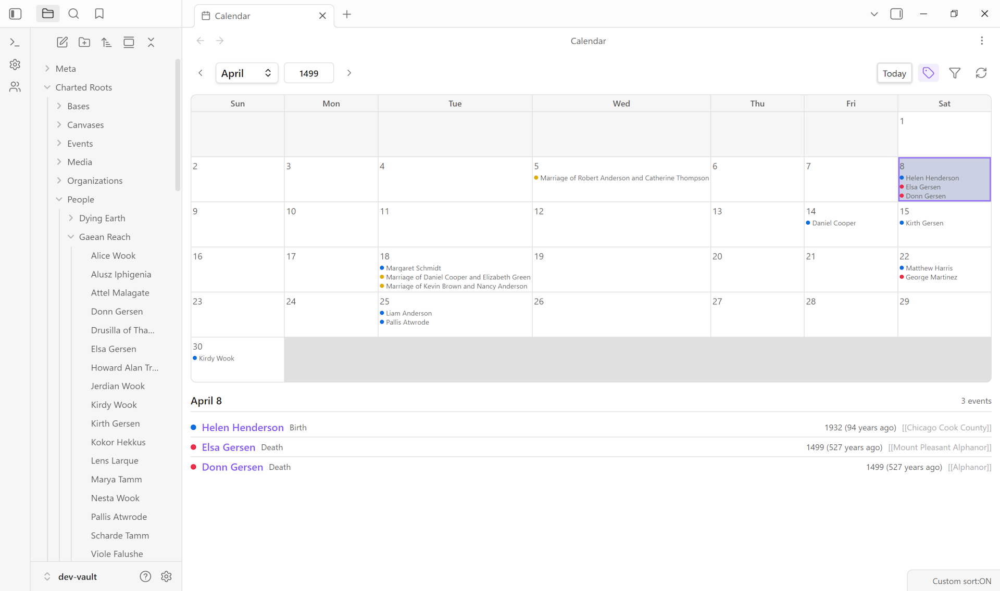

# Fictional Date Systems

Fictional Date Systems allow you to define custom calendars and eras for world-building, historical fiction, and alternate history research. This enables proper date handling for universes like Middle-earth (Third Age, Fourth Age), Westeros (years since Aegon's Conquest), or your own custom fictional worlds.



*Calendar View rendering a fictional date system in practice: events appear with their universe-specific date format.*

---

## Table of Contents

- [Overview](#overview)
- [Built-in Calendars](#built-in-calendars)
- [Using Fictional Dates](#using-fictional-dates)
- [Managing Date Systems](#managing-date-systems)
- [Creating Custom Systems](#creating-custom-systems)
- [Test Date Parsing](#test-date-parsing)
- [Technical Details](#technical-details)
- [Calendarium Integration](#calendarium-integration)
- [Future Enhancements](#future-enhancements)

---

## Overview

Fictional Date Systems support:

- **Era-based dating**: Define eras with names, abbreviations, and epoch offsets
- **Date parsing**: Recognize formats like "TA 2941" or "AC 283"
- **Canonical years**: Convert fictional dates to absolute timeline positions for sorting
- **Age calculation**: Calculate ages within a single calendar system
- **Universe scoping**: Link calendar systems to specific universes (see [Universe Notes](Universe-Notes))

---

## Built-in Calendars

Charted Roots includes four built-in calendar presets that you can enable or disable:

### Middle-earth Calendar

For Tolkien's Legendarium. Covers the major ages of Arda:

| Era | Abbreviation | Epoch | Notes |
|-----|--------------|-------|-------|
| First Age | FA | -6500 | Ends with defeat of Morgoth |
| Second Age | SA | -3441 | 3441 years, ends with defeat of Sauron |
| Third Age | TA | 0 | Reference point, 3021 years |
| Fourth Age | FoA | 3021 | Age of Men |

**Example dates**: `TA 2941` (Bilbo's adventure), `FoA 61` (Bilbo's departure)

### Westeros Calendar

For A Song of Ice and Fire / Game of Thrones. Uses Aegon's Conquest as epoch:

| Era | Abbreviation | Direction | Notes |
|-----|--------------|-----------|-------|
| Before Conquest | BC | Backward | Years before Aegon's landing |
| After Conquest | AC | Forward | Years after Aegon's landing |

**Example dates**: `AC 283` (Robert's Rebellion), `BC 100` (100 years before conquest)

### Star Wars Calendar

Uses the Battle of Yavin as epoch:

| Era | Abbreviation | Direction | Notes |
|-----|--------------|-----------|-------|
| Before the Battle of Yavin | BBY | Backward | Pre-Original Trilogy |
| After the Battle of Yavin | ABY | Forward | Post-Original Trilogy |

**Example dates**: `BBY 19` (Order 66), `ABY 4` (Battle of Endor)

### Generic Fantasy Calendar

A simple numbered age system for custom worlds:

| Era | Abbreviation | Epoch |
|-----|--------------|-------|
| First Age | A1 | -2000 |
| Second Age | A2 | -1000 |
| Third Age | A3 | 0 |
| Fourth Age | A4 | 1000 |

---

## Using Fictional Dates

### In Person Notes

Use fictional dates in the `born` and `died` frontmatter fields:

```yaml
---
name: Bilbo Baggins
universe: middle-earth
born: "TA 2890"
died: "FoA 61"
---
```

```yaml
---
name: Eddard Stark
universe: westeros
born: "AC 263"
died: "AC 298"
---
```

### Date Format

The parser recognizes dates in the format `{abbreviation} {year}`:

- `TA 2941` - Third Age, year 2941
- `AC 283` - After Conquest, year 283
- `BBY 19` - 19 years Before the Battle of Yavin
- `A2 500` - Second Age (generic), year 500

The abbreviation matching is case-insensitive (`TA`, `ta`, `Ta` all work). The year may also be written immediately after the abbreviation (`TA2941`), or the year may come first (`2941 TA`).

**Negative years.** A year may carry a leading minus sign for eras that count through a zero point — for example `EP -18` (eighteen years before the era's epoch). Negative years parse to a negative canonical year and sort earliest-first, so `EP -500` comes before `EP -200`, which comes before `EP -1`.

**Decade notation.** A trailing `s` marks a decade — `EP 30s` is treated as the start of the 30s (canonical year 30, flagged approximate). This combines with a negative year as `EP -30s`.

**Approximation and precision suffixes.** Approximation markers (`~`, `ish`, `circa`, `c.`, `?`) are recognized and flag the date approximate — for example `DE ~1226` or `PEF 260ish`. An ISO-style month/day suffix is accepted and reduced to the year for sorting and display: `DE 1264-08-15` and `DE 1222-03` both resolve to their era-year (the month/day is kept in the raw frontmatter for finer tiebreaks but isn't part of the parsed year).

---

## Managing Date Systems

### Accessing Settings

1. Open **Settings > Charted Roots > Dates & validation**
2. Expand the **Fictional date systems** section

Alternatively, from the Control Center Events tab, click the **Fictional date systems** button in the Actions card to navigate directly to Settings.

### Enable/Disable Fictional Dates

Toggle **Enable fictional dates** to turn the feature on or off globally.

When enabled, this also removes the 120-year age cap in the statistics dashboard — longevity analysis, record superlatives, and data quality checks will accept any lifespan. This allows fictional characters with extended lifespans (e.g., elves, vampires) to appear correctly in statistics.

### Show/Hide Built-in Systems

Toggle **Show built-in systems** to include or exclude the preset calendars (Middle-earth, Westeros, Star Wars, Generic Fantasy).

### Viewing Built-in Systems

The built-in systems are displayed in a table showing:
- **Name**: The calendar system name
- **Eras**: List of era abbreviations
- **Universe**: The universe scope (if any)
- **View**: Click the eye icon to view full details

---

## Creating Custom Systems

### Add a New System

1. Click **Add** in the Fictional date systems section of Settings
2. Fill in the system details:
   - **Name**: Display name (e.g., "My World Calendar")
   - **ID**: Auto-generated from name, or customize
   - **Universe**: Optional scope to link with person notes
3. Add eras using **+ Add era**
4. Configure each era:
   - **Name**: Full era name (e.g., "Age of Legends")
   - **Abbrev**: Short abbreviation used in dates (e.g., "AoL")
   - **Epoch**: Year offset from reference point (0 for primary era)
   - **Direction**: Forward (years increase) or Backward (like BC)
5. Select a **Default era** for new dates
6. Click **Save**

### Understanding Epochs

The epoch determines how eras relate to each other on a timeline:

- **Epoch 0**: The reference point
- **Positive epochs**: Later eras (e.g., Fourth Age starting at year 3021)
- **Negative epochs**: Earlier eras (e.g., Second Age starting at -3441)

For example, in Middle-earth:
- Third Age epoch = 0 (reference)
- Fourth Age epoch = 3021 (TA 3021 = FoA 1)
- Second Age epoch = -3441 (SA 1 = canonical year -3440)

### Editing Custom Systems

1. Find the system in the **Custom systems** section
2. Click the edit icon (pencil)
3. Make changes and click **Save**

### Deleting Custom Systems

1. Click the delete icon (trash) next to the custom system
2. Confirm deletion

**Note**: Built-in systems cannot be edited or deleted, only hidden.

---

## Test Date Parsing

Use the **Test date parsing** input to validate dates:

1. Enter a date string (e.g., "TA 2941")
2. See instant feedback:
   - **Success** (green): Shows era name, year, system, and canonical year
   - **Error** (red): Shows what went wrong

This helps verify that your custom systems are configured correctly.

---

## Technical Details

### Canonical Years

Fictional dates are converted to canonical years for sorting and comparison:

```
Canonical Year = epoch + (year × direction)
```

Where direction is +1 for forward eras and -1 for backward eras.

**Examples**:
- `TA 2941` → canonical 2941 (epoch 0 + 2941)
- `FoA 1` → canonical 3022 (epoch 3021 + 1)
- `SA 3441` → canonical 0 (epoch -3441 + 3441)
- `BBY 19` → canonical -19 (epoch 0 + 19 × -1)

### Age Calculation

Ages are calculated as the difference between canonical years:

```
Age = death_canonical - birth_canonical
```

For `TA 2890` to `FoA 61`:
- Birth canonical: 2890
- Death canonical: 3021 + 61 = 3082
- Age: 3082 - 2890 = 192 years (Bilbo lived to 131 in the books, so this simplified model doesn't account for the Shire Reckoning)

### Settings Storage

Date systems are stored in plugin settings:

```typescript
{
  enableFictionalDates: true,
  showBuiltInDateSystems: true,
  fictionalDateSystems: [
    // Custom systems stored here
  ]
}
```

---

## Calendarium Integration

Charted Roots integrates with the [Calendarium](https://github.com/javalent/calendarium) plugin to import calendar definitions. If you already use Calendarium for fantasy calendar management, you can now use those same calendars in Charted Roots without duplicate configuration.

### Enabling the Integration

1. Install and enable the [Calendarium](https://github.com/javalent/calendarium) plugin
2. Open **Settings → Charted Roots → Advanced → Integrations**
3. Set **Integration mode** to "Read-only (import calendars)"

### How It Works

- **Automatic import**: Calendarium calendars appear automatically in Charted Roots
- **Zero configuration**: Calendar names, eras, and abbreviations are imported as-is
- **Read-only**: Charted Roots reads from Calendarium but doesn't modify it
- **Invisible when not needed**: The Integrations card only appears if Calendarium is installed

### Where Calendarium Calendars Appear

Once enabled, imported calendars appear in:

- **Settings > Dates & validation > Fictional date systems**: Listed alongside built-in and custom systems
- **Create Event modal**: Available in the Date system dropdown when creating events
- **Date parsing**: Era abbreviations from Calendarium calendars work in date fields

### Limitations

The current integration (Phase 1) imports calendar structure only:

- Calendar names and eras are imported
- Era abbreviations are derived from Calendarium's format strings
- Year direction (forward/backward) is preserved

**Not yet supported:**
- Displaying Calendarium events on Charted Roots timelines
- Bidirectional sync between plugins
- Cross-calendar date translation

See the [Roadmap](Roadmap#calendarium-integration) for planned enhancements.

---

## Future Enhancements

Additional Calendarium integration features are planned:

- **Phase 2: Event display** - Show Calendarium events on person and place timelines
- **Phase 3: Bidirectional sync** - Keep events in sync between both plugins
- **Phase 4: Cross-calendar translation** - Convert dates between different calendar systems

See the [Calendarium Integration roadmap](Roadmap#calendarium-integration) for details.

---

## Related Documentation

- [Universe Notes](Universe-Notes) - Managing fictional worlds with default calendars
- [Frontmatter Reference](Frontmatter-Reference) - Full schema for person notes
- [Custom Relationships](Custom-Relationships) - Extended relationship types
- [Roadmap](Roadmap) - Planned enhancements including Chronological Story Mapping

---

**Questions?** Open an issue on [GitHub](https://github.com/banisterious/obsidian-charted-roots/issues).
